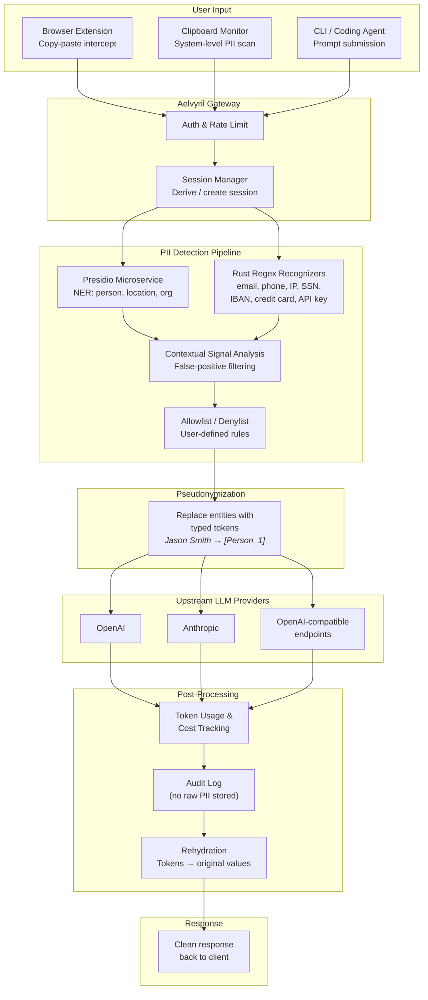
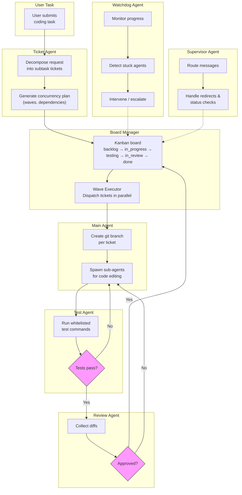

<p align="center">
  
</p>

<h1 align="center">Aelvyril</h1>

<p align="center">
  A local desktop privacy gateway for AI workflows — automatically intercepts and pseudonymizes accidental sensitive data leaks at the clipboard and prompt level, routes sanitized requests to any upstream LLM provider through secure OS keychain-backed credentials, and rehydrates responses transparently.
</p>

---

## Overview

Aelvyril is a local-first privacy desktop app that sits between developer tools and external model providers. It acts as a safety net for accidental sensitive data leaks — detecting and pseudonymizing PII in real time before it reaches the cloud, then restoring the original values in the response so the developer's workflow is uninterrupted.

Built with **Tauri v2** (Rust backend + React/TypeScript frontend), Aelvyril runs as a native desktop application on macOS, Windows, and Linux.

## What It Does

Aelvyril runs as a background desktop app and exposes a local OpenAI-compatible API endpoint with a gateway-issued API key. Users plug that key into coding agents, editors, or other AI clients instead of using upstream provider keys directly. The gateway authenticates the request, inspects the content, automatically pseudonymizes any detected sensitive data, forwards only the sanitized version to the real upstream provider, and rehydrates the response before delivering it back — all transparently.

Aelvyril also intercepts copy-paste events at the clipboard level and through a companion browser extension, catching accidental leaks at the moment sensitive content enters the workflow — before it even becomes part of a prompt.

## The Problem It Solves

Developers and teams using cloud AI tools regularly paste code, config files, logs, and emails into prompts without scanning what's in them. Aelvyril is a **safety net for accidental leaks**. Someone pastes a `.env` file into Cursor without thinking. A developer copies a snippet with a real API key still in it. A teammate shares a log with customer data. Aelvyril quietly catches those moments before they matter.

## Features

### Privacy & Pseudonymization

The gateway detects sensitive content using a layered approach:

1. **Presidio integration** — A local Presidio Python microservice provides NLP-based entity recognition (person names, locations, organizations) via spaCy/transformers
2. **Native Rust PII recognizers** — Reimplemented from Microsoft Presidio's structured patterns as pure regex (email, phone, IP address, domain, API key, credit card, SSN, IBAN, date, zip code)
3. **Contextual signal analysis** — A weighted feature-based classifier that evaluates surrounding context to distinguish real PII from false positives
4. **User-defined denylist** — Custom regex patterns that always flag (project-specific rules)

Detected entities are replaced with typed, numbered tokens before the request leaves the machine:

```
Jason Smith      → [Person_1]
SK-124124        → [SK_API_Key_1]
192.168.1.1      → [IP_Address_1]
acme-corp.com    → [Domain_1]
```

An **allowlist** lets users exempt patterns (internal codenames, company domains) from detection.

### Rehydration

A session-level mapping table tracks every token and its original value. When the upstream response returns, Aelvyril's rehydration layer scans the output, replaces all tokens with their originals, and delivers the fully restored response. The whole process is transparent to the user.

### Multi-Provider Routing

Users can add as many upstream providers as they want — OpenAI, Anthropic, or any OpenAI-compatible endpoint. Aelvyril routes automatically based on the model name in the request. If a provider fails, it falls back to the next available provider.

### Token Usage & Cost Tracking

Every LLM call passing through the gateway is tracked with per-session, per-tool, and per-model aggregation:

- **Token counts** — System, user, cached, output, and truncated tokens from API-reported `usage` fields (no local tokenization)
- **Cost estimation** — Per-model pricing table (integer cents, never floats) with provider-reported cost preferred when available
- **Latency metrics** — Per-call duration with p50/p99 percentile tracking
- **Efficiency ratios** — Context-to-output ratio, system overhead percentage, tokens per active day
- **Privacy guarantee** — Never stores raw content, user messages, or model responses. Only aggregate token counts and metadata.

### Session Management

Sessions are tied to conversation context. A new chat starts a fresh session with a clean mapping table. Configurable inactivity timeout defaults to 30 minutes. Users can view and clear active sessions from the desktop app.

### Audit Log

Every request is logged locally — what was detected, entity type, token mapping, upstream provider, and timestamp. The log never stores original sensitive values. Users can review, filter, and export the audit log from the desktop app.

### Orchestrator — Plan & Execute Coding Agent

A built-in coding agent that breaks tasks into subtasks, executes them via [pi](https://github.com/badlogic/pi-mono), and validates results:

- **Planning** — An LLM call through Aelvyril's gateway generates a structured plan with subtasks, allowed files, constraints, test commands, and acceptance criteria
- **Execution** — Each subtask spawns a `pi --mode rpc` subprocess for autonomous code editing with scoped file access
- **Validation** — Whitelisted test commands (cargo check, npm test, pytest, etc.) run after each subtask, with shell metacharacter injection prevention
- **Recovery** — Automatic replanning on failure, scope violations, or test failures; blocked state prompts user for guidance

### Clipboard Monitoring

A system-level clipboard listener scans pasted content for PII across all platforms:
- **macOS** — `pbpaste` polling
- **Windows** — PowerShell `Get-Clipboard` polling
- **Linux** — `xclip` (X11) and `wl-paste` (Wayland) polling

When sensitive content is detected, an OS notification alerts the user.

### Browser Extension

A Manifest V3 companion extension intercepts copy-paste events in web-based AI tools (ChatGPT, Claude, Gemini, Perplexity, and others). It communicates with the desktop app via a local WebSocket bridge and shows inline warning banners when sensitive content is detected.

### Security

- **OS keychain storage** — API keys stored in macOS Keychain, Windows Credential Manager, or Linux libsecret. Never written to disk, never logged.
- **TLS support** — Optional self-signed TLS for the local endpoint (defense-in-depth against local packet sniffing)
- **Rate limiting** — Per-client rate limits (configurable: requests per minute/hour, max concurrent)
- **Key lifecycle auditing** — In-memory audit of every key access (create, read, rotate, delete) with no key values ever logged
- **Loopback only** — Gateway binds to 127.0.0.1; no external traffic

### Onboarding

Three-step guided setup:
1. Add your first upstream provider and paste your API key
2. Copy the Aelvyril-issued local key into your tool
3. Optionally install the companion browser extension

Aelvyril auto-detects common tools (Cursor, VS Code, Claude CLI, pi) and shows tool-specific setup instructions.

## How It Works



### Orchestrator Pipeline



### Architecture (Text)

```
Copy-paste event or prompt submission
        ↓
Aelvyril Gateway — auth, rate limit, derive session
        ↓
PII Detection Pipeline (layered)
  ├─ Presidio microservice (NER: person, location, organization)
  ├─ Native Rust recognizers (regex: email, phone, IP, SSN, IBAN, etc.)
  ├─ Contextual signal analysis (false positive filtering)
  └─ Allowlist / denylist (user-defined rules)
        ↓
Pseudonymization — entities replaced with typed tokens
        ↓
Upstream provider (auto-routed by model name, with failover)
        ↓
Token usage recording + audit logging
        ↓
Rehydration — tokens replaced with original values
        ↓
Clean response back to client
```

### Tech Stack

| Layer | Technology |
|-------|-----------|
| Desktop shell | **Tauri v2** (Rust) |
| Backend | **Rust** — axum HTTP server, tokio async runtime |
| Frontend | **React 19** + TypeScript, Vite, React Router |
| PII Detection | Presidio (Python microservice) + native Rust regex recognizers |
| Key Storage | `keyring` crate (OS-native: Keychain, Credential Manager, libsecret) |
| Persistence | SQLite (rusqlite) for audit log, token usage, and orchestrator state |
| Browser Extension | Manifest V3 (Chrome/Firefox), WebSocket bridge to desktop app |
| Styling | CSS Modules with design system tokens (dark theme) |

### Backend Modules

```
src-tauri/src/
├── gateway/          # HTTP server, request routing, forwarding, streaming
├── pii/              # PII engine, recognizers, Presidio integration
├── pseudonym/        # Tokenizer, rehydrator, mapping table
├── config/           # App settings, provider configuration, persistent storage
├── keychain/         # OS-native secret storage abstraction
├── audit/            # Audit log store and queries
├── session/          # Session manager with timeout
├── clipboard/        # System-level clipboard monitoring
├── security/         # Rate limiting, TLS, key lifecycle auditing
├── token_usage/      # Token tracking, cost estimation, aggregation
├── orchestrator/     # Plan-and-execute coding agent (state machine, planner, executor, validator)
├── lists/            # Allow/deny list manager
├── perf/             # Latency benchmarking, PII detection cache
├── model/            # Contextual signal classifier (feature-based regex + llama.cpp GGUF)
├── commands/         # Tauri IPC commands
├── bridge/           # WebSocket bridge for browser extension
├── bootstrap/        # App initialization and setup
└── state.rs          # Shared application state
```

### Frontend Pages

| Page | Description |
|------|-------------|
| **Dashboard** | Live stats — requests processed, entities detected, sessions, providers, token usage, entity type breakdown |
| **Audit Log** | Filterable request history with entity types, providers, and pseudonymization details |
| **Sessions** | Active session list with creation time, last activity, timeout config, and manual clearing |
| **Settings** | Provider management, PII recognizer toggles, sensitivity thresholds, allow/deny lists, rate limits, orchestrator config |
| **Onboarding** | Guided setup wizard with tool auto-detection |

## Screenshots

> Coming soon

## Getting Started

### Prerequisites

- [Rust](https://rustup.rs/) (latest stable)
- [Node.js](https://nodejs.org/) v18+
- [pnpm](https://pnpm.io/) (or npm)
- Platform-specific: Xcode CLI tools (macOS), Visual Studio Build Tools (Windows)

### Install & Run

```bash
# Clone the repo
git clone https://github.com/GulanesKorp/Aelvyril.git
cd Aelvyril

# Install frontend dependencies
pnpm install

# Run in development mode
pnpm tauri dev
```

### Build for Production

```bash
pnpm tauri build
```

This produces platform-specific installers (`.dmg` for macOS, `.msi` for Windows, `.deb`/`.AppImage` for Linux).

## Configuration

All settings are managed from the desktop app's Settings page and persisted to `~/.local/share/aelvyril/settings.json`. Key configuration options:

| Setting | Default | Description |
|---------|---------|-------------|
| `gateway_port` | `4242` | Local gateway port |
| `gateway_bind_address` | `127.0.0.1` | Loopback-only binding |
| `session_timeout_minutes` | `30` | Session inactivity timeout |
| `clipboard_monitoring` | `false` | Enable clipboard PII scanning |
| `confidence_threshold` | `0.5` | PII detection confidence (0.0–1.0) |
| `rate_limit_max_requests_per_minute` | `60` | Per-client rate limit |
| `enabled_recognizers` | All enabled | Which PII recognizers are active |

### Environment Variables

| Variable | Description |
|----------|-------------|
| `AELVYRIL_GATEWAY_PORT` | Override gateway port |
| `AELVYRIL_GATEWAY_BIND` | Override bind address |

## Browser Extension

The extension ships alongside the desktop app and supports Chrome and Firefox. It intercepts clipboard events on popular AI chat sites (ChatGPT, Claude, Gemini, Poe, Perplexity, and more) and communicates with the desktop app via WebSocket.

### Supported Sites

- ChatGPT / chat.openai.com
- Claude (claude.ai)
- Gemini (gemini.google.com)
- Poe (poe.com)
- Perplexity (perplexity.ai)
- Character.AI
- You.com
- HuggingFace Chat

## Orchestrator

The built-in orchestrator is a plan-and-execute coding agent that leverages Aelvyril's privacy pipeline for all LLM calls.

### How It Works

1. User submits a coding task through the Aelvyril UI
2. A planning model (via Aelvyril's gateway) generates a structured plan with subtasks
3. Each subtask is executed by spawning `pi --mode rpc` as a subprocess
4. After execution, whitelisted test commands validate the changes
5. On failure, the orchestrator replans with error context or prompts the user

### Configuration

| Setting | Default | Description |
|---------|---------|-------------|
| `enabled` | `false` | Enable the orchestrator |
| `planning_model` | — | Model for plan generation (routed through gateway) |
| `executor_model` | — | Model for pi's code execution (routed through gateway) |
| `max_subtask_retries` | `2` | Retries before replanning |
| `max_files_per_subtask` | `6` | File scope limit per subtask |
| `executor_timeout_secs` | `600` | Per-subtask timeout (10 min) |
| `max_tool_calls` | `30` | Tool call limit before abort |


 Aelvyril — Overview Plan                                                                                                                                                                                                                           
                                                                                                                                                                                                                                                    
 ```                                                                                                                                                                                                                                                
   ┌─────────────────────────────────────────────────────────┐                                                                                                                                                                                      
   │                        AELVYRIL                         │                                                                                                                                                                                      
   │                   (localhost:4000)                        │                                                                                                                                                                                    
   │                                                         │                                                                                                                                                                                      
   │  ┌─────────┐    ┌──────────┐    ┌──────────┐           │                                                                                                                                                                                       
   │  │  PII     │    │  Router  │    │  Key     │           │                                                                                                                                                                                      
   │  │  Detect  │───►│  & Proxy │───►│  Vaults  │           │                                                                                                                                                                                      
   │  │  & Mask  │    │          │    │          │           │                                                                                                                                                                                      
   │  └─────────┘    └──────────┘    └──────────┘           │                                                                                                                                                                                       
   │       ▲               │                │                │                                                                                                                                                                                      
   └───────│───────────────│────────────────│────────────────┘                                                                                                                                                                                      
           │               │                │                                                                                                                                                                                                       
           │         ┌─────┴─────┐    ┌──────┴──────┐                                                                                                                                                                                               
      Pi sends      │           │    │  OS Keychain  │                                                                                                                                                                                              
      prompt with   │  Route to: │    │  (or .env)   │                                                                                                                                                                                              
      real PII      │           │    │              │                                                                                                                                                                                               
           │        │  ┌─OpenAI │    │  OPENAI_KEY  │                                                                                                                                                                                               
           │        │  ├─Anthropic   │  ANTHROPIC_KEY│                                                                                                                                                                                              
           │        │  └─Ollama  │    └──────────────┘                                                                                                                                                                                              
           │        │           │                                                                                                                                                                                                                   
           ▼        └─────┬─────┘                                                                                                                                                                                                                   
     ┌──────────┐         │                                                                                                                                                                                                                         
     │ Sanitize │    ┌────┴─────┐                                                                                                                                                                                                                   
     │ [EMAIL_1]│    │ Response  │                                                                                                                                                                                                                  
     │ [SSN_2]  │    │ Rehydrate │                                                                                                                                                                                                                  
     │ [PHONE_3]│    │ [EMAIL_1] │──► "john@real.com"                                                                                                                                                                                               
     └──────────┘    └──────────┘                                                                                                                                                                                                                   
 ```
────────────────────────────────────────────────────────────────────────────────                                                                                                                                                                   
                                                                                                                                                                                                                                                    
 ### The 3 Core Jobs                                                                                                                                                                                                                                
                                                                                                                                                                                                                                                    
 ┌───┬───────────────────┬───────────────────────────────────────────────────────────────────────────────────────────────────────────┐                                                                                                              
 │ # │ Job               │ What it does                                                                                              │                                                                                                              
 ├───┼───────────────────┼───────────────────────────────────────────────────────────────────────────────────────────────────────────┤                                                                                                              
 │ 1 │ PII Detect & Mask │ Scan outgoing prompts → find emails, SSNs, phones, names, etc. → replace with typed tokens like [EMAIL_1] │                                                                                                              
 ├───┼───────────────────┼───────────────────────────────────────────────────────────────────────────────────────────────────────────┤                                                                                                              
 │ 2 │ Route & Proxy     │ Forward the now-sanitized request to the right LLM provider based on model alias                          │                                                                                                              
 ├───┼───────────────────┼───────────────────────────────────────────────────────────────────────────────────────────────────────────┤                                                                                                              
 │ 3 │ Rehydrate         │ When the response comes back, swap [EMAIL_1] → john@real.com so Pi sees the real data                     │                                                                                                              
 └───┴───────────────────┴───────────────────────────────────────────────────────────────────────────────────────────────────────────┘                                                                                                              
                                                                                                                                                                                                                                                    
 API keys never leave Aelvyril. Pi never sees them.                                                                                                                                                                                                 
                                                                                                                                                                                                                                                    
 ────────────────────────────────────────────────────────────────────────────────                                                                                                                                                                   
                                                                                                                                                                                                                                                    
 ### Data Flow                                                                                                                                                                                                                                      
                                                                                                                                                                                                                                                    
 ```                                                                                                                                                                                                                                                
   Pi sends:  "Contact john@acme.com at 555-1234"                                                                                                                                                                                                   
                   │                                                                                                                                                                                                                                
                   ▼                                                                                                                                                                                                                                
   Step 1 — PII Detect & Mask:                                                                                                                                                                                                                      
            "Contact [EMAIL_1] at [PHONE_1]"                                                                                                                                                                                                        
            Token map: { EMAIL_1: "john@acme.com", PHONE_1: "555-1234" }                                                                                                                                                                            
                   │                                                                                                                                                                                                                                
                   ▼                                                                                                                                                                                                                                
   Step 2 — Route & Proxy (using OS keychain for API key):                                                                                                                                                                                          
            → OpenAI API with real key                                                                                                                                                                                                              
                   │                                                                                                                                                                                                                                
                   ▼                                                                                                                                                                                                                                
   LLM responds: "I'll email [EMAIL_1] and call [PHONE_1]"                                                                                                                                                                                          
                   │                                                                                                                                                                                                                                
                   ▼                                                                                                                                                                                                                                
   Step 3 — Rehydrate:                                                                                                                                                                                                                              
            "I'll email john@acme.com and call 555-1234"                                                                                                                                                                                            
                   │                                                                                                                                                                                                                                
                   ▼                                                                                                                                                                                                                                
   Pi receives: "I'll email john@acme.com and call 555-1234"                                                                                                                                                                                        
 ```                                                                                                                                                                                                                                                
                                                                                                                                                                                                                                                    
 ────────────────────────────────────────────────────────────────────────────────                                                                                                                                                                   
                                                                                                                                                                                                                                                    
 ### Language Choice: Go (least packages)                                                                                                                                                                                                           
                                                                                                                                                                                                                                                    
 ┌───────────────────────┬──────────────────────────────────────────────┐                                                                                                                                                                           
 │ Need                  │ Go stdlib covers it?                         │                                                                                                                                                                           
 ├───────────────────────┼──────────────────────────────────────────────┤                                                                                                                                                                           
 │ HTTP server           │ ✅ net/http                                  │                                                                                                                                                                           
 ├───────────────────────┼──────────────────────────────────────────────┤                                                                                                                                                                           
 │ JSON parse            │ ✅ encoding/json                             │                                                                                                                                                                           
 ├───────────────────────┼──────────────────────────────────────────────┤                                                                                                                                                                           
 │ Regex (PII detection) │ ✅ regexp                                    │                                                                                                                                                                           
 ├───────────────────────┼──────────────────────────────────────────────┤                                                                                                                                                                           
 │ Reverse proxy         │ ✅ net/http/httputil                         │                                                                                                                                                                           
 ├───────────────────────┼──────────────────────────────────────────────┤                                                                                                                                                                           
 │ OS keychain           │ ⚠️ 1 package: github.com/keybase/go-keychain │                                                                                                                                                                           
 ├───────────────────────┼──────────────────────────────────────────────┤                                                                                                                                                                           
 │ TOML/YAML config      │ ⚠️ 1 package: gopkg.in/yaml.v3               │                                                                                                                                                                           
 └───────────────────────┴──────────────────────────────────────────────┘                                                                                                                                                                           
                                                                                                                                                                                                                                                    
 Total external packages: 2. Everything else is stdlib. Single binary output. No runtime needed.                                                                                                                                                    
                                                                                                                                                                                                                                                    
 ────────────────────────────────────────────────────────────────────────────────                                                                                                                                                                   
                                                                                                                                                                                                                                                    
 ### PII Detection (pure regex, no packages)                                                                                                                                                                                                        
                                                                                                                                                                                                                                                    
 ```go                                                                                                                                                                                                                                              
   var piiPatterns = map[string]string{                                                                                                                                                                                                             
       "EMAIL":  `[a-zA-Z0-9._%+-]+@[a-zA-Z0-9.-]+\.[a-zA-Z]{2,}`,                                                                                                                                                                                  
       "PHONE":  `\b\d{3}[-.]?\d{3}[-.]?\d{4}\b`,                                                                                                                                                                                                   
       "SSN":    `\b\d{3}-\d{2}-\d{4}\b`,                                                                                                                                                                                                           
       "CC":     `\b\d{4}[-\s]?\d{4}[-\s]?\d{4}[-\s]?\d{4}\b`,                                                                                                                                                                                      
       "APIKEY": `(sk-\w{20,}|sk-ant-\w{20,})`,                                                                                                                                                                                                     
   }                                                                                                                                                                                                                                                
   // Replace with [TYPE_N], keep map for rehydration                                                                                                                                                                                               
 ```                                                                                                                                                                                                                                                
                                                                                                                                                                                                                                                    
 ────────────────────────────────────────────────────────────────────────────────                                                                                                                                                                   
                                                                                                                                                                                                                                                    
 ### File Structure (tiny)                                                                                                                                                                                                                          
                                                                                                                                                                                                                                                    
 ```                                                                                                                                                                                                                                                
   aelvyril/                                                                                                                                                                                                                                        
   ├── main.go          ← entry point, config, start server                                                                                                                                                                                         
   ├── pii.go           ← detect + mask + rehydrate                                                                                                                                                                                                 
   ├── proxy.go         ← route to OpenAI/Anthropic/Ollama                                                                                                                                                                                          
   ├── keys.go          ← OS keychain access                                                                                                                                                                                                        
   ├── config.yaml      ← model routes + PII rules                                                                                                                                                                                                  
   └── go.mod           ← 2 dependencies                                                                                                                                                                                                            
 ```                                                                                                                                                                                                                                                
                                                                                                                                                                                                                                                    
 ~4 Go files. 2 external packages. 1 binary. Zero runtime.                                                                                                                                                                                          
                                                                                                                                                                                                                                                    
 ────────────────────────────────────────────────────────────────────────────────                                                                                                                                                                   
                                                                                                                                                                                                                                                    
 ### Config file                                                                                                                                                                                                                                    
                                                                                                                                                                                                                                                    
 ```yaml                                                                                                                                                                                                                                            
   # config.yaml                                                                                                                                                                                                                                    
   listen: ":4000"                                                                                                                                                                                                                                  
                                                                                                                                                                                                                                                    
   routes:                                                                                                                                                                                                                                          
     smart:                                                                                                                                                                                                                                         
       provider: openai                                                                                                                                                                                                                             
       model: gpt-4                                                                                                                                                                                                                                 
     fast:                                                                                                                                                                                                                                          
       provider: anthropic                                                                                                                                                                                                                          
       model: claude-3-haiku                                                                                                                                                                                                                        
     local:                                                                                                                                                                                                                                         
       provider: ollama                                                                                                                                                                                                                             
       model: llama3                                                                                                                                                                                                                                
                                                                                                                                                                                                                                                    
   pii:                                                                                                                                                                                                                                             
     enabled: true                                                                                                                                                                                                                                  
     types: [email, phone, ssn, apikey]                                                                                                                                                                                                             
                                                                                                                                                                                                                                                    
   keys:                                                                                                                                                                                                                                            
     openai: os_keychain    # or env:OPENAI_KEY                                                                                                                                                                                                     
     anthropic: os_keychain                                                                                                                                                                                                                         
     ollama: none                                                                                                                                                                                                                                   
 ```                                                                                                                                                                                                                                                
                                                                                                                                                                                                                                                    
 ────────────────────────────────────────────────────────────────────────────────                                                                  

### Safeguards

- Executor file changes validated against `allowed_files` scope
- Test commands restricted to a whitelist (npm, cargo, pytest, etc.) with shell metacharacter injection prevention
- Automatic abort and kill on timeout or tool call limit
- All LLM calls pass through Aelvyril's PII pipeline automatically
- Pi subprocess fresh-spawned per subtask (clean state, no cross-contamination)

---

*In one line: Aelvyril is a local desktop privacy gateway for AI workflows that automatically intercepts and pseudonymizes accidental sensitive data leaks at the clipboard and prompt level, routes sanitized requests to any upstream LLM provider through secure OS keychain-backed credentials, and rehydrates responses transparently — so developers can use cloud AI tools without worrying about what they paste.*
