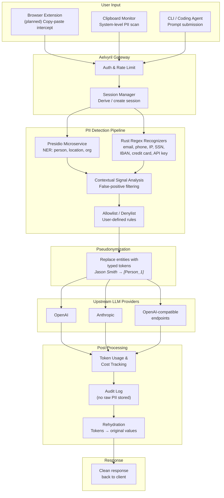

<p align="center">
  
</p>

<h1 align="center">Aelvyril</h1>

<p align="center">
  A local desktop privacy gateway for AI workflows — automatically intercepts and pseudonymizes accidental sensitive data leaks at the clipboard and prompt level, routes sanitized requests to any upstream LLM provider through secure OS keychain-backed credentials, and rehydrates responses transparently.
</p>

---

## Overview

Aelvyril is a local-first privacy desktop app that sits between developer tools and external model providers. It acts as a safety net for accidental sensitive data leaks — detecting and pseudonymizing PII in real time before it reaches the cloud, then restoring the original values in the response so the developer's workflow is uninterrupted.

Built with **Tauri v2** (Rust backend + React/TypeScript frontend), Aelvyril runs as a native desktop application on macOS, Windows, and Linux.

## What It Does

Aelvyril runs as a background desktop app and exposes a local OpenAI-compatible API endpoint with a gateway-issued API key. Users plug that key into coding agents, editors, or other AI clients instead of using upstream provider keys directly. The gateway authenticates the request, inspects the content, automatically pseudonymizes any detected sensitive data, forwards only the sanitized version to the real upstream provider, and rehydrates the response before delivering it back — all transparently.

Aelvyril also intercepts copy-paste events at the clipboard level (a companion browser extension is planned for a future release to catch leaks at the moment sensitive content enters the workflow inside web-based tools).

## The Problem It Solves

Developers and teams using cloud AI tools regularly paste code, config files, logs, and emails into prompts without scanning what's in them. Aelvyril is a **safety net for accidental leaks**. Someone pastes a `.env` file into Cursor without thinking. A developer copies a snippet with a real API key still in it. A teammate shares a log with customer data. Aelvyril quietly catches those moments before they matter.

## Features

### Privacy & Pseudonymization

The gateway detects sensitive content using a layered approach:

1. **Presidio integration** — A local Presidio Python microservice provides NLP-based entity recognition (person names, locations, organizations) via spaCy/transformers
2. **Native Rust PII recognizers** — Reimplemented from Microsoft Presidio's structured patterns as pure regex (email, phone, IP address, domain, API key, credit card, SSN, IBAN, date, zip code)
3. **Contextual signal analysis** — A weighted feature-based classifier that evaluates surrounding context to distinguish real PII from false positives
4. **User-defined denylist** — Custom regex patterns that always flag (project-specific rules)

Detected entities are replaced with typed, numbered tokens before the request leaves the machine:

```
Jason Smith      → [Person_1]
SK-124124        → [SK_API_Key_1]
192.168.1.1      → [IP_Address_1]
acme-corp.com    → [Domain_1]
```

An **allowlist** lets users exempt patterns (internal codenames, company domains) from detection.

### Rehydration

A session-level mapping table tracks every token and its original value. When the upstream response returns, Aelvyril's rehydration layer scans the output, replaces all tokens with their originals, and delivers the fully restored response. The whole process is transparent to the user.

### Multi-Provider Routing

Users can add as many upstream providers as they want — OpenAI, Anthropic, or any OpenAI-compatible endpoint. Aelvyril routes automatically based on the model name in the request. If a provider fails, it falls back to the next available provider.

### Token Usage & Cost Tracking

Every LLM call passing through the gateway is tracked with per-session, per-tool, and per-model aggregation:

- **Token counts** — System, user, cached, output, and truncated tokens from API-reported `usage` fields (no local tokenization)
- **Cost estimation** — Per-model pricing table (integer cents, never floats) with provider-reported cost preferred when available
- **Latency metrics** — Per-call duration with p50/p99 percentile tracking
- **Efficiency ratios** — Context-to-output ratio, system overhead percentage, tokens per active day
- **Privacy guarantee** — Never stores raw content, user messages, or model responses. Only aggregate token counts and metadata.

### Session Management

Sessions are tied to conversation context. A new chat starts a fresh session with a clean mapping table. Configurable inactivity timeout defaults to 30 minutes. Users can view and clear active sessions from the desktop app.

### Audit Log

Every request is logged locally — what was detected, entity type, token mapping, upstream provider, and timestamp. The log never stores original sensitive values. Users can review, filter, and export the audit log from the desktop app.

### Clipboard Monitoring

A system-level clipboard listener scans pasted content for PII across all platforms:
- **macOS** — `pbpaste` polling
- **Windows** — PowerShell `Get-Clipboard` polling
- **Linux** — `xclip` (X11) and `wl-paste` (Wayland) polling

When sensitive content is detected, an OS notification alerts the user.

### Browser Extension

A Manifest V3 companion extension is planned (not yet shipped in this repository) to intercept copy-paste events in web-based AI tools. The desktop app already exposes the local WebSocket bridge (`src-tauri/src/bridge/`) that the extension will use to show inline warning banners when sensitive content is detected.

### Security

- **OS keychain storage** — API keys stored in macOS Keychain, Windows Credential Manager, or Linux libsecret. Never written to disk, never logged.
- **TLS support** — Optional self-signed TLS for the local endpoint (defense-in-depth against local packet sniffing)
- **Rate limiting** — Per-client rate limits (configurable: requests per minute/hour, max concurrent)
- **Key lifecycle auditing** — In-memory audit of every key access (create, read, rotate, delete) with no key values ever logged
- **Loopback only** — Gateway binds to 127.0.0.1; no external traffic

### Onboarding

Three-step guided setup:
1. Add your first upstream provider and paste your API key
2. Copy the Aelvyril-issued local key into your tool
3. Optionally install the companion browser extension (when available in a future release)

Aelvyril auto-detects common tools (Cursor, VS Code, Claude CLI) and shows tool-specific setup instructions.

## How It Works


```mermaid
flowchart TD
    subgraph UserInput["User Input"]
        A1["Browser Extension<br/>(planned) Copy-paste intercept"]
        A2["Clipboard Monitor<br/>System-level PII scan"]
        A3["CLI / Coding Agent<br/>Prompt submission"]
    end

    subgraph Gateway["Aelvyril Gateway"]
        B1["Auth & Rate Limit"]
        B2["Session Manager<br/>Derive / create session"]
    end

    subgraph PII["PII Detection Pipeline"]
        C1["Presidio Microservice<br/>NER: person, location, org"]
        C2["Rust Regex Recognizers<br/>email, phone, IP, SSN,<br/>IBAN, credit card, API key"]
        C3["Contextual Signal Analysis<br/>False-positive filtering"]
        C4["Allowlist / Denylist<br/>User-defined rules"]
    end

    subgraph Pseudonymize["Pseudonymization"]
        D1["Replace entities with<br/>typed tokens<br/><em>Jason Smith → [Person_1]</em>"]
    end

    subgraph Upstream["Upstream LLM Providers"]
        E1["OpenAI"]
        E2["Anthropic"]
        E3["OpenAI-compatible<br/>endpoints"]
    end

    subgraph PostProcess["Post-Processing"]
        F1["Token Usage &<br/>Cost Tracking"]
        F2["Audit Log<br/>(no raw PII stored)"]
        F3["Rehydration<br/>Tokens → original values"]
    end

    subgraph Response["Response"]
        G1["Clean response<br/>back to client"]
    end

    A1 --> B1
    A2 --> B1
    A3 --> B1
    B1 --> B2
    B2 --> C1
    B2 --> C2
    C1 --> C3
    C2 --> C3
    C3 --> C4
    C4 --> D1
    D1 --> E1
    D1 --> E2
    D1 --> E3
    E1 --> F1
    E2 --> F1
    E3 --> F1
    F1 --> F2
    F2 --> F3
    F3 --> G1
```

### PII Detection Coverage (what's actually shipped)

The Liquid encoder package implements the **full 40-type taxonomy**, but through two
mechanisms rather than one label schema:

- The token-classification head (`label_schema.json` — 27 types: contact.*, credential.api_key,
  device.mac_address, financial.{bank_account,credit_card,iban,swift_bic},
  healthcare.{condition,medical_record,medication}, identity.{person_name,ssn,national_id,
  passport,drivers_license,date_of_birth}, legal.case_number, location.gps_coordinates,
  online.{url,username}, org.company_name, special.{political,religion}).
- The shipped decode helpers extend it: `pii_hybrid_decode.py` (19 shape/cue types:
  `credential.jwt`, `credential.private_key`, `credential.connection_string`,
  `financial.crypto_wallet`, `device.imei`, `financial.amount`, …) and `context_cued.py`
  (16 types: `credential.password`, `identity.tax_id`, `developer.login_credentials`,
  `developer.device_id`, `healthcare.health_plan_id`, `legal.case_number`, …).

**Live E2E verification** (2026-08-07, real sidecar + headless gateway + mock upstream,
one sample per type, all layers wired):

- Direct model (`/liquid/pii`): **26/40 exact label**; 31/40 flagged under some PII label.
- Full gateway pipeline (Presidio + Liquid + regex, wire-checked): **40/40 samples produced
  at least one PII token on the wire** — every type is protected end-to-end. **28/40 produced
  the exact expected token type**; the other 12 were flagged under a neighboring PII type
  (content still pseudonymized):
  - Liquid-namespace vs legacy names: email→`CONTACT_EMAIL`, ip→`CONTACT_IP_ADDRESS`,
    api_key→`CREDENTIAL_API_KEY`, credit_card→`FINANCIAL_CREDIT_CARD`, iban→`FINANCIAL_IBAN`,
    person→`IDENTITY_PERSON_NAME`, date_of_birth→`CONTACT_ADDRESS` (overlap resolution picked
    the winning span).
  - Overlap-resolution category shifts: `special.political` ("Democratic Party") →
    `ORGANIZATION` (Presidio won), `special.religion` ("Maria is a practicing Catholic") →
    `IDENTITY_PERSON_NAME` (containing span won over the "Catholic" keyword), `device.imei` →
    `CONTACT_PHONE`, `developer.login_credentials` → `CREDENTIAL_PASSWORD`.

Honest caveats:

- `special.orientation` and `special.health_status` have **no model output path** (they appear
  on the model card but in NEITHER the head NOR the decode helpers), but the keyword regexes
  cover them at phrase level ("identifies as bisexual", "HIV positive") — verified on the wire.
- `financial.amount` is declared in the decode helpers but did not fire on any realistic
  money sample — the regex layer carries it.
- `identity.tax_id` detects on "TIN" / "Tax identification number" phrasing but missed
  "employer EIN" (context-dependent).
- `healthcare.condition`, `healthcare.medication`, `legal.case_number`, `org.company_name`,
  `special.political` are in the head but were not detected in short samples; keyword regexes
  (commit `b79f69a`) cover condition/medication/political at phrase level, and company_name is
  caught by Presidio (ORGANIZATION).

Naming notes: `identity.ssn` maps to the legacy `SSN` variant; the encoder's
`developer.login_credentials` / `developer.device_id` namespaces match the actual model card.

Policy rules only enforce when **Liquid policy linter** is enabled in Settings; the shipped
starter pack ships disabled by design (block rules can disrupt legitimate workflows such as
coding agents).

### Architecture (Text)

```
Copy-paste event or prompt submission
        ↓
Aelvyril Gateway — auth, rate limit, derive session
        ↓
PII Detection Pipeline (layered)
  ├─ Presidio microservice (NER: person, location, organization)
  ├─ Native Rust recognizers (regex: email, phone, IP, SSN, IBAN, etc.)
  ├─ Contextual signal analysis (false positive filtering)
  └─ Allowlist / denylist (user-defined rules)
        ↓
Pseudonymization — entities replaced with typed tokens
        ↓
Upstream provider (auto-routed by model name, with failover)
        ↓
Token usage recording + audit logging
        ↓
Rehydration — tokens replaced with original values
        ↓
Clean response back to client
```

### Tech Stack

| Layer | Technology |
|-------|-----------|
| Desktop shell | **Tauri v2** (Rust) |
| Backend | **Rust** — axum HTTP server, tokio async runtime |
| Frontend | **React 18** + TypeScript, Vite, React Router |
| PII Detection | Presidio (Python microservice) + native Rust regex recognizers |
| Key Storage | `keyring` crate (OS-native: Keychain, Credential Manager, libsecret) |
| Persistence | SQLite (rusqlite) for audit log and token usage |
| Browser Extension | Manifest V3 (Chrome/Firefox), WebSocket bridge to desktop app (planned; not yet shipped) |
| Styling | CSS Modules with design system tokens (dark theme) |

### Backend Modules

```
src-tauri/src/
├── gateway/          # HTTP server, request routing, forwarding, streaming
├── pii/              # PII engine, recognizers, Presidio integration
├── pseudonym/        # Tokenizer, rehydrator, mapping table
├── config/           # App settings, provider configuration, persistent storage
├── keychain/         # OS-native secret storage abstraction
├── audit/            # Audit log store and queries
├── session/          # Session manager with timeout
├── clipboard/        # System-level clipboard monitoring
├── security/         # Rate limiting, TLS, key lifecycle auditing
├── token_usage/      # Token tracking, cost estimation, aggregation
├── lists/            # Allow/deny list manager
├── perf/             # Latency benchmarking, PII detection cache
├── policy/           # Liquid LFM2.5-Encoder-350M PII detector + policy linter
├── llama/            # Local LLM integration (feature-gated)
├── commands/         # Tauri IPC commands
├── bridge/           # WebSocket bridge for browser extension
├── bootstrap/        # App initialization and setup
└── state.rs          # Shared application state
```

### Frontend Pages

| Page | Description |
|------|-------------|
| **Dashboard** | Live stats — requests processed, entities detected, sessions, providers, token usage, entity type breakdown |
| **Audit Log** | Filterable request history with entity types, providers, and pseudonymization details |
| **Sessions** | Active session list with creation time, last activity, timeout config, and manual clearing |
| **Settings** | Provider management, PII recognizer toggles, sensitivity thresholds, allow/deny lists, rate limits, policy rules |
| **Security** | Rate-limit status, key lifecycle audit, TLS status, latency stats |
| **Onboarding** | Guided setup wizard with tool auto-detection |

## Screenshots

> Coming soon

## Getting Started

### Prerequisites

- [Rust](https://rustup.rs/) (latest stable)
- [Node.js](https://nodejs.org/) v18+
- [pnpm](https://pnpm.io/) (or npm)
- Platform-specific: Xcode CLI tools (macOS), Visual Studio Build Tools (Windows)

### Install & Run

```bash
# Clone the repo
git clone https://github.com/GeneGulanesJr/Aelvyril.git
cd Aelvyril

# Install frontend dependencies
pnpm install

# Run in development mode
pnpm tauri dev
```

### Build for Production

```bash
pnpm tauri build
```

This produces platform-specific installers (`.dmg` for macOS, `.msi` for Windows, `.deb`/`.AppImage` for Linux).

## Configuration

All settings are managed from the desktop app's Settings page and persisted to `~/.local/share/aelvyril/settings.json`. Key configuration options:

| Setting | Default | Description |
|---------|---------|-------------|
| `gateway_port` | `4242` | Local gateway port |
| `gateway_bind_address` | `127.0.0.1` | Loopback-only binding |
| `session_timeout_minutes` | `30` | Session inactivity timeout |
| `clipboard_monitoring` | `false` | Enable clipboard PII scanning |
| `confidence_threshold` | `0.5` | PII detection confidence (0.0–1.0) |
| `rate_limit_max_requests_per_minute` | `60` | Per-client rate limit |
| `enabled_recognizers` | All enabled | Which PII recognizers are active |

### Environment Variables

| Variable | Description |
|----------|-------------|
| `AELVYRIL_GATEWAY_PORT` | Override gateway port |
| `AELVYRIL_GATEWAY_BIND` | Override bind address |

## Browser Extension (planned)

A companion browser extension is **not** included in this repository yet. It is planned for a future release. When shipped, it will intercept clipboard events on popular AI chat sites and communicate with the desktop app via a local WebSocket bridge.

---

*In one line: Aelvyril is a local desktop privacy gateway for AI workflows that automatically intercepts and pseudonymizes accidental sensitive data leaks at the clipboard and prompt level, routes sanitized requests to any upstream LLM provider through secure OS keychain-backed credentials, and rehydrates responses transparently — so developers can use cloud AI tools without worrying about what they paste.*
